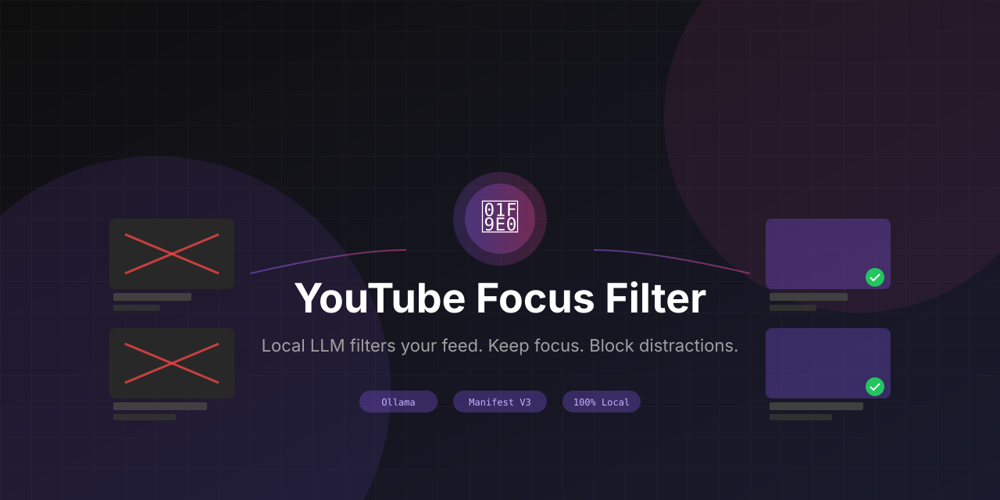

# YouTube Focus Filter

Filter YouTube recommendations using a local LLM. Keep videos aligned with your goals. Block distractions automatically.

**Requirements:** [Ollama](https://ollama.ai) running locally

## Install

1. Clone or download this repo
2. Open `brave://extensions` or `chrome://extensions`
3. Enable "Developer mode"
4. Click "Load unpacked" and select this folder

## Setup Ollama

```bash
brew install ollama
OLLAMA_ORIGINS="*" ollama serve
ollama pull llama3.2:3b
```

The `OLLAMA_ORIGINS="*"` is required for the extension to communicate with Ollama.

## How It Works

| Step | What Happens |
|------|--------------|
| 1 | Extension detects video thumbnails on YouTube |
| 2 | Extracts title, channel, description |
| 3 | Sends to local Ollama for evaluation |
| 4 | LLM decides ALLOW or BLOCK based on your goals |
| 5 | Blocked videos are hidden, allowed videos shown |

All processing happens locally. No data leaves your machine.

## Configuration

Click the extension icon to open settings:

| Setting | Description |
|---------|-------------|
| Enable/Disable | Toggle filtering on/off |
| Goals | Describe what you want to focus on |
| Presets | Quick templates for common use cases |
| Whitelist | Channels to always show |
| Blacklist | Channels to always hide |
| Ollama URL | Default: `http://localhost:11434` |
| Model | Default: `llama3.2:3b` |

## Writing Good Goals

Be specific. Include both what you want AND what distracts you.

**Bad:**
```
I want to learn and be productive
```

**Good:**
```
Learning TypeScript, React, system design. Working on a SaaS startup.
Block: gaming, celebrity drama, political rants, mukbangs, prank videos, reaction content.
```

## Filtering Logic

The LLM follows these rules:

- **BLOCK** if clearly entertainment, drama, gossip, clickbait
- **BLOCK** if unrelated to your focus AND not educational
- **ALLOW** if educational, informative, or skill-building
- **ALLOW** if ambiguous — doesn't over-block
- **ALLOW** tutorials, documentaries, lectures, how-tos

## Where It Filters

| Location | Selector | Status |
|----------|----------|--------|
| Homepage | `ytd-rich-item-renderer` | ✅ |
| Search Results | `ytd-video-renderer` | ✅ |
| Watch Page Sidebar | `yt-lockup-view-model` | ✅ |
| Shorts Shelf | `ytd-reel-item-renderer` | ✅ |

## Troubleshooting

**Extension shows "Ollama not running"**

Start Ollama with CORS enabled:
```bash
OLLAMA_ORIGINS="*" ollama serve
```

**Videos not being filtered**

1. Check console for `[YouTube Focus Filter]` logs
2. Run `ytffDebug.status()` in console
3. Run `ytffDebug.checkSelectors()` to verify elements found

**All videos showing (not filtering)**

- Ensure you've set goals in the extension popup
- Check Ollama is running: `curl http://localhost:11434/api/tags`
- Clear cache and re-evaluate from popup

**Wrong videos being blocked**

- Refine your goals to be more specific
- Use whitelist for channels you always want
- Click "Clear Cache & Re-evaluate" after changing goals

## Debug Commands

Open browser console on YouTube and run:

```javascript
ytffDebug.status()        // Check extension state
ytffDebug.checkSelectors() // Verify video elements found
ytffDebug.listVideos()     // List all detected videos
ytffDebug.forceProcess()   // Manually trigger evaluation
```

## Files

```
youtube-focus-filter/
├── manifest.json           # Extension manifest (MV3)
├── background.js           # Service worker
├── content-scripts/
│   ├── youtube.js          # DOM manipulation
│   └── youtube.css         # Loading/error states
├── popup/
│   ├── popup.html
│   ├── popup.js
│   └── popup.css
├── lib/
│   ├── ollama.js           # Ollama API client
│   └── cache.js            # IndexedDB cache
└── icons/
```

## Privacy

- All processing happens locally via Ollama
- No data sent to external servers
- No analytics or tracking
- Video decisions cached locally for 24 hours

## License

MIT
